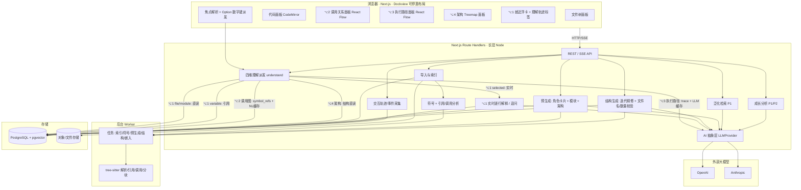

# Glint · 技术规格说明书（Spec）

| 项目 | 内容 |
| --- | --- |
| 产品名称 | **Glint**（旧草稿 Thinkode 一律以 Glint 为准） |
| 文档版本 | v0.6（技术栈认知 + Agent Bar + 模块关系加深） |
| 状态 | 草稿 · 待评审 |
| 最后更新 | 2026-06-20 |
| 关联文档 | 《Glint-PRD.md》 |
| 研究依据 | Gao et al., arXiv:2504.04553v2（CodeMap） |
| 适用阶段 | 个人自用 MVP（主链路）+ 为 P1/P2 预留扩展 |

> v0.6 变更：① 技术栈检测与认知（§4.10、`tech_stack_items`/`tech_literacy`、API、Edge bar 面板）；② **Agent Bar 编排 Agent**（§4.11、`agent_sessions/messages`、`/api/agent`、前端面板，§8）；③ 加深预生成的**模块关系推断**（§4.2）；④ 布局骨架补 Edge bar + 侧栏（§8）。
>
> v0.5 变更：① 改名 Glint；② 核心交互改为 **选中 + Option 数字键（⌥1/⌥2/⌥3/⌥4 四维理解）**，删除旧的"Option 悬停 + Space 钉住"；③ 新增**理解轨迹**（卡片收纳为标签）；④ 布局改为 **VS Code 式可停靠多面板**（Dockview/rc-dock），⌥1 浮卡、⌥2/⌥3 React Flow 面板、⌥4 Treemap 面板；⑤ 数据/API/里程碑相应调整。保留预生成 map-reduce、迭代精修 + 文件名/数量校验、成本分层、模型分层、AI 抽象层、概念标签、RAG(P1)。

---

## 1. 概述与设计原则

Glint 是一个 web 应用：用户上传本地项目，系统索引、符号解析并预生成"架构层 + 模块层"理解与各元素角色卡片。用户在 **VS Code 式可停靠多面板**界面里浏览，**选中任意对象后按 Option 数字键，即在四个维度获得理解**（⌥1 为什么这么写 / ⌥2 调用关系 / ⌥3 执行路径 / ⌥4 架构），同一焦点四维自由切换；卡片固定停留、再触发时旧卡收纳成"理解轨迹"标签。选中代码的逐行解释与追问实时调 AI，其余尽量直读库/静态分析。所有解释记录（带概念标签）与交互轨迹持久化，为成长分析铺路。

五条原则：

**交互零延迟。** Option 触发必须快。除"选中代码逐行解释/追问"外，尽量来自**预生成直读或确定性静态分析**（§4.3、§4.9）。

**主链路优先。** 先跑通"上传 → 预生成 → 可停靠浏览 → 选中+Option 四维理解 → 记录与轨迹入库"。泛化检索、全量 RAG、成长分析、上线相关为可插拔扩展。

**成本前置可控。** 预生成只覆盖架构+模块层及角色卡片；⌥1 选中代码走实时；结构图用迭代精修但有轮次/成本上限。配合模型分层、缓存、批处理、增量（§4.9）。

**AI 可切换。** OpenAI/Anthropic 收敛到统一接口，按"任务画像"配置切换（§7）。

**为未来留缝。** 数据模型从第一天为"带标签记录""交互轨迹""向量检索""多用户"预留（§5）。

---

## 2. 技术栈选型

| 层 | 选型 | 作用 |
| --- | --- | --- |
| 语言 | **TypeScript**（端到端） | 单代码库，个人维护成本最低 |
| 框架 | **Next.js（App Router）** | 全栈一体：React 前端 + Route Handlers 后端 |
| 运行/部署 | **长驻 Node 容器**（Railway/Render/Fly.io） | 预生成/迭代是长任务，长驻优于纯 Serverless |
| 数据库 | **PostgreSQL + Prisma** | 关系型主存 + 类型安全迁移 |
| 向量检索 | **pgvector** | 语义/泛化检索复用同一 Postgres（P1） |
| 代码解析 | **web-tree-sitter（WASM）** | AST、**符号索引与引用/调用分析**（支撑 ⌥1 变量级、⌥2 调用图、⌥3 trace） |
| **可停靠布局** | **Dockview 或 rc-dock** | VS Code 式面板拖拽/分屏/停靠/标签化/收起，省自研布局成本 |
| 代码展示/选区 | **CodeMirror 6**（自定义主题） | 轻量、易主题化；**不用 Monaco** 以避免"VS Code 长相"，并承载选区/光标焦点 |
| ⌥2/⌥3 图渲染 | **React Flow + dagre/ELK 布局**（MVP；后续可评估 D3/d3-graphviz） | 分层 DAG：当前居中、调用者上/被调用者下、不重叠、fit-to-bounds |
| ⌥4 架构鸟瞰 | **Treemap**（D3 treemap 或 Nivo treemap） | 可缩放区块版图 |
| ⌥1 浮卡 | 自研浮层（Floating UI 定位） | 就近浮卡 + 轨迹标签 |
| 文件树 | 自研 React 组件 | 交互参考 VS Code，视觉自有设计 |
| 样式/组件 | Tailwind + shadcn/ui，调性见 Design System（电蓝×黑灰·Linear 风·像素点缀） | 美观、可换肤 |
| 前端状态 | Zustand | 项目/焦点/维度/轨迹/面板布局/会话 |
| AI SDK | openai + @anthropic-ai/sdk | 封装在统一 Provider 接口后（§7） |
| 后台任务 | MVP：DB 任务表 + 进程内 worker；扩展：BullMQ+Redis | 索引/预生成/结构/嵌入异步化 |
| 嵌入向量 | text-embedding-3-small 等廉价档 | 代码块向量（P1） |

**选型要点。** TS 全栈：重计算在大模型 API，本地只做索引/AST/编排，Node 生态够用（web-tree-sitter、TS SDK、pgvector），个人自用维护成本最低；未来需重型分析可拆独立 Python/LSP worker。长驻容器：预生成/迭代是长任务。CodeMirror 而非 Monaco：避免 VS Code 长相、易自定义主题与浮卡装饰。**布局用 Dockview/rc-dock**：直接获得"面板可拖拽/分屏/停靠/收起"的 VS Code 式能力，每个视图=一个可停靠面板。**⌥2/⌥3 用 React Flow 求快**（论文 CodeMap 用 d3-graphviz/DOT，视觉打磨阶段再评估）。

---

## 3. 系统架构

### 3.1 组件图



### 3.2 关键组件职责

**符号 + 引用/调用分析（SVC_SYMBOL）。** tree-sitter 解析每个源文件，抽取符号（函数/类/方法/变量）及位置、签名；建立**引用**（变量被谁读/写）与**调用**（谁调用谁）关系。这是 ⌥1 变量级（"谁用了它"）、⌥2 调用图、⌥3 执行路径 trace 的**确定性、免费**数据来源。

**四维理解派发（SVC_UND）。** Glint 的交互心脏。接收"当前焦点 + 维度键"，按来源分层取数据（§4.3）：⌥1 选中代码转实时解释、文件/模块直读、变量读引用、函数/类懒生成缓存；⌥2 由 symbol_refs 组图 + 连线 NL 缓存；⌥3 由调用 trace + LLM 叙述缓存；⌥4 由结构 + 架构分析直读。

**结构生成（SVC_STRUCT）。** 迭代精修生成架构组件结构（供 ⌥4 Treemap 与全局视图），用文件名/数量做硬事实校验（§4.2）。

**交互采集（SVC_EVENT）。** 接收去抖后的"选中/⌥触发/钻取/标签召回"事件与理解轨迹，写 `interaction_events`（+ 可选 `trajectory_items`），作为成长分析信号源。

其余见各流程章节。

---

## 4. 核心处理流程

### 4.1 导入与索引

前端 `webkitdirectory` 选目录或拖拽，打包 zip 上传。后端解压落地，遍历建文件索引（语言、大小、行数、内容哈希、是否二进制）。**过滤**：跳过 `node_modules`、`.git`、`dist/build/out`、`vendor`、锁文件、min/压缩、超大（>512KB）与二进制。投递**符号索引**任务（tree-sitter → `symbols`、`symbol_refs`、`call_edges`），再投递预生成与结构任务，返回 `jobId`，前端经 SSE 看进度。

### 4.2 预生成（角色卡片 + 模块 + 架构 + 结构）

**Map · 文件级角色卡片**（廉价模型 + 批处理 + 缓存）：职责、关键导出符号、依赖、在所属模块/业务中的角色（供 ⌥1 文件焦点直读），写 `file_summaries`。

**Reduce · 模块级（含模块关系推断 — "把架构-模块关系理解到"的核心）**：① 按目录/包边界 + `call_edges`/`import` 聚类成模块；② **把符号级调用/依赖向上汇聚成模块间关系**——谁依赖谁、数据往哪流、谁是入口（确定性，来自 call_edges/import 的聚合，不靠模型猜）；③ 在确定的关系骨架上用模型补**职责、业务定位、"为什么这样组织"、与其他模块关系的一句话说明**。写 `modules`（关系存 `depends_on` + `edge_explanations`），供 ⌥1 模块焦点直读、⌥2/⌥4 模块视图、⌥3 业务叙述。

**Reduce · 架构级**（中等模型，只读摘要）：架构概述、技术栈/框架及关系，写 `project_analysis`。

**结构 · 迭代精修 + 硬事实校验（复刻论文准确性机制）。** 生成架构组件结构（节点=模块/文件、含归属与规模），用于 ⌥4 Treemap 与全局视图：① 模型产出结构（+ 连线一句话解释）；② **校验**：与真实文件索引比对，`Accuracy = TP/(TP+FP+FN)`（文件名/数量是确定事实，**AI 自判不算数**）；③ 有漏/错文件则带差异进入下一轮**迭代修正**；④ 收敛即停（约 3–4 轮）或达轮次/成本上限。每轮写 `structure_iterations`，结果写 `structure_nodes`、`edge_explanations`。

**持久化与增量**：全部入库；再次打开直接读取。文件变更按 `content_hash` 判脏，仅重算受影响文件并向上滚动更新模块/架构/结构。

### 4.3 四维理解：派发与来源分层（交互心脏）

前端把"当前焦点"（对象类型 + 引用 / 选区）与按下的维度键交给 `/api/understand`。**来源分层是零延迟与低成本的关键**：

| 维度键 | 焦点 | 返回 | 来源 | 延迟/成本 |
| --- | --- | --- | --- | --- |
| ⌥1 | 选中代码（行/段） | 逐行"为什么这么写"卡片 | 实时调 AI（SVC_EXPLAIN，SSE） | 实时 |
| ⌥1 | 文件 / 模块 | 角色卡片 | `file_summaries` / `modules` 直读 | 瞬时 / 0 |
| ⌥1 | 函数 / 类 | 做什么/谁触发/输出去哪 | `dimension_cache` 命中直读；未命中懒生成缓存 | 首次 1 次调用，之后 0 |
| ⌥1 | 变量 | 从哪来、谁读/谁改 | `symbol_refs` 聚合（AST） | 瞬时 / 0（确定） |
| ⌥2 | 模块/函数 | 调用关系图（节点+连线+NL） | `call_edges`/`symbol_refs` 组图（确定）+ 连线 NL 取 `edge_explanations`（缓存，未命中懒生成） | 结构瞬时；NL 首次懒生成 |
| ⌥3 | 模块/函数 | 执行路径/时序图 | 从调用图 **trace** + LLM 叙述，写/读 `dimension_cache` | 首次实时，之后直读 |
| ⌥4 | 模块/项目 | 架构 Treemap + 概述 | `structure_nodes` + `project_analysis` 直读 | 瞬时 / 0 |

**焦点解析（前端 Focus Resolver）。** 统一异构目标：代码面板由光标行列经 `symbols` 定位符号/变量或取选区；文件树节点 → 文件/文件夹；图节点 → `ref_type/ref_id`。统一为 `{focusType, ref, selection?}` 交派发服务，实现"同一手势、四维语境感知"。

### 4.4 理解轨迹（卡片收纳，取代 Space 钉住）

⌥1 浮卡**固定停留**。当用户在新位置再次 Option，前端把旧卡**收缩为轨迹标签**（不销毁），新卡弹出；标签串成"理解轨迹"。点击标签 = 重新展开完整卡片。轨迹默认存于前端状态（Zustand），并把每次"触发/收纳/召回"作为事件上报（§4.8）；可选持久化 `trajectory_items` 以便跨会话/刷新召回。标签保留数量与收纳位置见 PRD 开放问题。

### 4.5 钻取（在更细对象再 Option）

不设第二个键。用户把焦点移到更细对象（模块内某文件/函数）再 Option，新卡弹出、旧卡收纳。⌥2/⌥3/⌥4 面板可随焦点联动刷新到更细范围。补充：浮卡内的关系词（"被 api 调用""依赖 session"）可做成可点链接，点击即把焦点切到该对象并重新理解。

### 4.6 ⌥1 实时逐行解释与追问

选区提交 `{projectId, fileId, selection, question?, parentId?}`。后端组织上下文：选中片段 + 局部上下文（所在函数/前后行）+ 文件/模块卡片 + 架构概述摘要；调**中等模型**，**SSE 流式**返回结构化结果（§7.4：语言/语法/逐行+为什么/在上下文中的位置与作用、概念标签、可附泛化）。落 `query_logs` 并触发概念标签。追问经 `parentId` 串线程，复用上下文。

### 4.7 预置信息与自动展示

每层维护预置关键信息/问题（`preset_questions`，初期静态配置）。进入项目/聚焦模块时自动展示该层关键信息（架构概览/入口/阅读指引、模块说明，均预生成直读），点击预置问题走解释链路并入库打标签。

### 4.8 交互轨迹/事件采集

前端对高频动作去抖/采样（如选中悬留 > 阈值才记），`⌥触发`/`钻取`/`标签召回`必报，批量上报写 `interaction_events`（焦点类型、维度、层级、时间、停留）。这是比"问了什么"更结构化的弱项信号源；控制写入量（批量 + 阈值）。

### 4.9 成本控制（汇总）

| 杠杆 | 做法 | 效果 |
| --- | --- | --- |
| 维度来源分层 | ⌥1 文件/模块/变量直读/AST、函数/类懒缓存；⌥2 结构确定+NL缓存；⌥3 trace+缓存；⌥4 直读；仅 ⌥1 选中代码/追问实时 | **触发瞬时且≈0 成本**（核心） |
| 范围裁剪 | 预生成只做架构+模块+角色卡片 | 避免全量逐行 |
| 目录过滤 | 跳过依赖/产物/二进制/超大文件 | 大幅减少待分析文件 |
| 分层归纳 | map-reduce，架构层只读摘要 | 成本与规模近似解耦 |
| 结构轮次上限 | 迭代精修设最大轮次 + 收敛即停 | 控制结构生成成本 |
| 模型分层 | 卡片/标签/懒卡片用廉价档；解释/架构/结构/执行叙述用中等档 | 单位成本降数倍 |
| 提示缓存 | 共享系统提示与项目上下文缓存 | 命中约 1 折 |
| 批处理 | 预生成走 Batch API | 约 5 折 |
| 增量更新 | 按哈希只重算脏文件 | 二次成本趋近 0 |
| 软上限 | 每项目可配置成本/时长上限，超限暂停提示 | 防失控 |

**量级估算（仅设预期）。** 约 1000 源文件、文件卡片走廉价档（Haiku 4.5 ≈ $1/$5，或 GPT‑5.4 nano ≈ $0.2/$1.25），叠加批处理+缓存，全量预生成大致 **个位数人民币到十几元**；结构迭代每轮只在摘要/结构上跑，增量小。⌥1 实时解释每次几美分。⌥1 文件/模块/变量、⌥2 结构、⌥4 走直读/AST，**几乎不产生 token 成本**。以实际计量为准，软上限兜底。

### 4.10 技术栈检测与认知（Tech Stack）

**检测（确定性）。** 导入索引阶段从**清单与扩展名**识别语言/框架/库：解析 `package.json`/`requirements.txt`/`go.mod`/`Gemfile`/`pom.xml` 等依赖清单 + 文件后缀 + 关键配置文件，写 `tech_stack_items`。可数事实可信，不靠模型猜。

**认知卡片三段。** 「是什么 / 用途 / 在整个代码体系中的位置」是**项目无关的通用知识**，按技术 `slug` 存入**全局** `tech_literacy` 缓存——`jQuery` 是什么对所有项目都一样，**全平台缓存一次、近乎免费**（首次未命中才调一次廉价模型）。「在本仓库的角色与关键位置」来自预生成的 `project_analysis` + `structure_nodes` + `symbol_refs`（哪里 import/使用），可跳转使用处。

**与 ⌥4 联动。** 技术项 ↔ 架构 Treemap 互跳；顺使用处接 ⌥2/⌥3 看具体联系。Edge bar「技术栈」面板是此能力的入口（前端见 §8）。

### 4.11 Agent Bar（开放式探索 · 编排 Agent）

四维派发解决"对当前焦点的结构化理解"；Agent Bar 解决**跨焦点、开放式**问题。后端一个**编排 Agent**（工具调用循环）：

**工具集（Agent 可调用）。** ① `retrieve`：全量 RAG（pgvector + 关键词）召回相关代码块/文件/模块摘要（依赖 F24/`code_chunks`；P1 落地前先用 symbol/结构检索兜底）；② `symbols / callgraph / refs`：查符号、调用子图、引用（确定性）；③ `dimension(focus, k)`：像工具一样复用既有四维服务触发 ⌥1–⌥4；④ `structure / techstack`：读架构与技术栈。

**循环。** 规划 → 调用工具 → 观察 → 必要时再调 → 综合答案。**SSE 流式**输出五类事件：`token`（增量文本）、`citation`（文件/符号/节点引用）、`action`（界面动作）、`suggestion`（探索建议）、`done`。

**驱动界面（action）。** Agent 产出结构化动作让前端执行：`open_panel` / `focus`（跳焦点）/ `highlight`（图上高亮节点/边）/ `trigger_dimension`（替用户触发某 ⌥）。导航类即时执行；写/副作用类需二次确认（本阶段基本无写操作）。

**主动建议（suggestion）。** 答完给"接下来看哪 / 可能漏了什么"，每条带可点 action。

**记录与成本。** 会话写 `agent_sessions/agent_messages`；产生的探索动作同样进 `interaction_events`（成长信号）。模型档：规划/综合用中等档；工具内子调用按各自 TaskProfile（多为直读/缓存，成本可控）。

---

## 5. 数据模型与存储

> PostgreSQL；`jsonb` 半结构化；`vector` 来自 pgvector。MVP 单用户但保留 `users` 与外键。

### 5.1 项目与文件
**users**(id, email, name, created_at) · **projects**(id, user_id, name, source_type[local|github], storage_ref, language_summary jsonb, status, settings jsonb, timestamps) · **files**(id, project_id, rel_path, lang, size_bytes, loc, content_hash, is_binary, created_at；索引 `(project_id, rel_path)`)。

### 5.2 符号 / 引用 / 调用（支撑 ⌥1 变量、⌥2、⌥3）
**symbols**(id, file_id, project_id, kind[function|class|method|variable], name, qualified_name, start_line, end_line, signature)；索引 `(project_id, file_id)`、`(project_id, name)`。
**symbol_refs**(id, symbol_id, project_id, ref_file_id, ref_line, ref_kind[read|write|call|def])；索引 `(symbol_id)`。
**call_edges**(id, project_id, caller_symbol_id, callee_symbol_id, ref_count)；由 symbol_refs(call) 聚合，供 ⌥2 组图与 ⌥3 trace。

### 5.3 预生成产物（供 ⌥1/⌥4 直读）
**file_summaries**(id, file_id, project_id, summary, role, called_by jsonb, calls jsonb, key_symbols jsonb, model, source_hash, created_at) — ⌥1 文件焦点。
**modules**(id, project_id, name, path_scope, responsibility, business_role, is_entry bool, depends_on jsonb, file_ids jsonb, model, created_at) — ⌥1 模块焦点。
**project_analysis**(id, project_id, version, architecture_overview, tech_stack jsonb, frameworks jsonb, model, created_at) — ⌥4 概述。
**structure_nodes**(id, project_id, parent_id, kind[dir|file|module], name, rel_path, module_id?, loc, size_bytes) — ⌥4 Treemap 数据。
**edge_explanations**(id, project_id, source_ref, target_ref, relation_type, nl_explanation, model, created_at) — ⌥2 连线自然语言（缓存）。
**structure_iterations**(id, project_id, round, accuracy, missing_files jsonb, extra_files jsonb, created_at) — 迭代+校验审计。
**tech_stack_items**(id, project_id, kind[language|framework|library|tool|datastore], name, slug, version?, detected_from jsonb, usage_refs jsonb, role, created_at) — 检测到的技术项 + 在本仓库的角色/使用处（Tech Stack 面板、⌥4 联动）。

### 5.4 懒生成缓存
**dimension_cache**(id, project_id, focus_type, focus_ref, dimension[1|2|3|4], payload jsonb, source, model, source_hash, created_at) — 通用懒生成缓存：⌥1 函数/类卡片、⌥3 执行路径叙述等首次生成后写回，之后直读；索引 `(project_id, focus_ref, dimension)`。
**tech_literacy**(slug PK, kind, name, what, purpose, ecosystem_position, aliases jsonb, model, created_at) — **全局**（非按项目）技术认知缓存：是什么/用途/生态位置，跨项目复用、近乎免费。

### 5.5 记录、标签、轨迹（成长分析地基，MVP 即采集）
**query_logs**(id, project_id, user_id, file_id?, level[code|module|arch], mode[selection|followup|preset|search|freeform], selection jsonb, snippet, question?, answer, parent_id?, provider, model, prompt_tokens, completion_tokens, cost_usd, latency_ms, created_at)；索引 `(user_id, created_at)`。
**concept_tags**(id, slug unique, name, category, aliases jsonb, status[active|pending], created_at)。
**query_concept_tags**((query_log_id, concept_tag_id) PK, confidence, source[model|rule])；索引 `(concept_tag_id)`。
**interaction_events**(id, user_id, project_id, session_id, action[select|dim1|dim2|dim3|dim4|drill|recall], focus_type[folder|file|module|function|class|variable|selection], focus_ref, level, dwell_ms, created_at)；索引 `(user_id, created_at)`、`(project_id, focus_type)`。
**trajectory_items**(id, user_id, project_id, session_id, order_idx, focus_type, focus_ref, dimension, created_at) — 可选，跨会话召回理解轨迹。
**user_concept_stats**((user_id, concept_tag_id) PK, ask_count, dim_counts jsonb, last_at, trend jsonb, mastery_signal real) — 成长分析物化（P1/P2）。

### 5.6 检索与任务
**code_chunks**(id, file_id, project_id, start_line, end_line, kind, symbol, ast_fingerprint, normalized_text, embedding vector)（P1，ivfflat/hnsw 索引）。
**preset_questions**(id, level, scope?, text, order)。
**jobs**(id, project_id, type[index|symbol|pregen|structure|embed], status, progress jsonb, error?, timestamps)。
**agent_sessions**(id, user_id, project_id, title, created_at) — Agent Bar 会话。
**agent_messages**(id, session_id, role[user|assistant|tool], content, citations jsonb, actions jsonb, suggestions jsonb, tool_calls jsonb, tokens, cost_usd, created_at) — 含引用/界面动作/建议/工具调用。

### 5.7 设计要点
成长分析地基（query_logs + 标签三件套 + interaction_events）**MVP 第一天就建并采集**。`dimension_cache`/`code_chunks` 延后填充。所有分析产物带 `model`/`source_hash`，支持按版本追溯与增量重算。⌥2 调用图与 ⌥4 Treemap 主体为**确定性数据**（symbol_refs / structure_nodes），仅自然语言部分用 LLM 并缓存。

---

## 6. API 设计

REST + SSE，挂 Next.js Route Handlers。鉴权 MVP 从简（单用户）。

| 方法 | 路径 | 说明 |
| --- | --- | --- |
| POST | `/api/projects` | 创建并上传代码（multipart zip），返回 project + jobId |
| GET | `/api/projects` · `/api/projects/:id` | 列表 / 详情与状态 |
| DELETE | `/api/projects/:id` | 删除（连带代码与记录） |
| POST | `/api/projects/:id/reindex` | 增量重建（索引/符号/预生成/结构） |
| GET | `/api/jobs/:jobId/stream` | **SSE**：任务进度 |
| GET | `/api/projects/:id/tree` · `/files?path=` | 文件树 / 文件内容 |
| **POST** | **`/api/understand`** | **四维理解派发**：body `{projectId, focus:{type, ref, selection?}, dimension:1\|2\|3\|4}` → 按 §4.3 返回卡片/调用图/执行路径/Treemap；⌥1 选中代码为 **SSE** 流式，其余 JSON（首次懒生成可能稍慢） |
| GET | `/api/projects/:id/architecture` | ⌥4 结构 Treemap + 概述（直读） |
| GET | `/api/projects/:id/techstack` | 技术栈清单（语言/框架/库 + 本仓库角色/使用处） |
| GET | `/api/tech/:slug` | 技术认知（是什么/用途/生态位置，全局缓存） |
| GET | `/api/symbols/:symbolId/refs` | ⌥1 变量引用（谁读/写/用，确定性） |
| GET | `/api/symbols/:symbolId/callgraph` | ⌥2 调用子图（结构 + NL） |
| POST | `/api/events` | 批量上报交互轨迹/事件 |
| **POST** | **`/api/agent`** | **SSE**：Agent Bar 探索；body `{projectId, sessionId?, message}` → 流式 `token/citation/action/suggestion/done`（§4.11） |
| POST | `/api/search/generalize` | 泛化检索（P1） |
| GET | `/api/insights/weak-points` | 成长分析弱项聚合（P1/P2） |
| GET/PUT | `/api/settings` | 模型/厂商/成本上限（MVP 后端配置） |

**`POST /api/understand` 响应示例（⌥2 调用关系）**
```json
{
  "dimension": 2,
  "focus": { "type": "function", "ref": "auth/guard.ts#requireUser" },
  "graph": {
    "nodes": [{"id":"auth/guard.ts#requireUser","label":"requireUser","kind":"function"},
              {"id":"api/user.ts#getProfile","label":"getProfile","kind":"function"}],
    "edges": [{"from":"api/user.ts#getProfile","to":"auth/guard.ts#requireUser",
               "relation":"calls","nl":"getProfile 在返回资料前先调用 requireUser 校验登录"}]
  },
  "source": "symbol_refs+edge_cache"
}
```

---

## 7. AI 抽象层设计

### 7.1 接口（TypeScript）
```ts
type Provider = 'openai' | 'anthropic';
interface LLMMessage { role: 'system'|'user'|'assistant'; content: string; }
interface LLMRequest {
  messages: LLMMessage[]; model?: string;
  temperature?: number; maxTokens?: number;
  responseFormat?: 'text'|'json'; jsonSchema?: object; cachePrompt?: boolean;
}
interface LLMUsage { promptTokens: number; completionTokens: number; costUsd: number; }
interface LLMResponse { text: string; json?: unknown; usage: LLMUsage; provider: Provider; model: string; }
interface LLMStreamChunk { delta: string; done: boolean; usage?: LLMUsage; }
interface LLMProvider {
  readonly name: Provider;
  complete(req: LLMRequest): Promise<LLMResponse>;
  stream(req: LLMRequest): AsyncIterable<LLMStreamChunk>;
  embed(texts: string[], model?: string): Promise<number[][]>;
  estimateCost(u: {promptTokens:number;completionTokens:number}, model: string): number;
}
```

### 7.2 任务画像与模型分层
| TaskProfile | 用途 | 默认档（可配置） |
| --- | --- | --- |
| `file_card` | 文件级角色卡片（量大） | 廉价：Haiku 4.5 / GPT‑5.4 nano，走 Batch |
| `symbol_card` | ⌥1 函数/类懒卡片 | 廉价档 |
| `module_arch` | 模块/架构归纳 | 中等：Sonnet 4.6 / GPT‑5.4 |
| `structure_gen` | ⌥4 结构（+连线解释），迭代精修 | 中等档；few-shot 约束格式 |
| `edge_nl` | ⌥2 连线自然语言 | 廉价档（缓存） |
| `exec_path` | ⌥3 执行路径叙述（基于 trace） | 中等档（缓存） |
| `explain` | ⌥1 选中代码实时解释/追问 | 中等档（质量优先） |
| `tagging` | 概念标签 | 随 explain 附带 |
| `embedding` / `generalize_note` | 向量 / 泛化点评（P1） | 廉价档 |
| `agent` | Agent Bar 规划与综合（工具调用循环） | 中等档（质量优先） |

配置 `{ profile: { provider, model, temperature, batch?, cache? } }`，存环境变量/配置表；切厂商或模型只改配置。**MVP：Key 与配置只在后端**。

### 7.3 结构生成的迭代精修循环
`structure_gen` 是受 `SVC_STRUCT` 控制的循环：组装提示（few-shot 格式示例 + 真实文件清单）→ 产出结构 → 用文件索引做 TP/FP/FN 校验 → 不达标带差异进入下一轮 → 收敛或达上限停。每轮写 `structure_iterations`。

### 7.4 ⌥1 结构化输出 Schema
```json
{
  "language": "TypeScript",
  "syntax": ["可选链 ?.", "async/await"],
  "lineByLine": [{"lines":"42-43","explain":"…","why":"为什么这么写"}],
  "positionInContext": "在 requireUser 守卫函数中，作为返回前的前置校验",
  "role": "保证后续逻辑只对已登录用户执行",
  "concepts": [{"slug":"async","name":"异步","confidence":0.9}],
  "generalization": [{"where":"api/order.ts:88","note":"同样的守卫模式"}]
}
```

### 7.5 健壮性
统一超时、指数退避重试、并发限流（保护预生成/结构批量）、失败降级（同档跨厂商回退）、每次调用用量与成本记账。

---

## 8. 前端实现要点

**布局骨架与可停靠面板（Dockview/rc-dock）。** 骨架 ＝ 最左 **Edge bar**（竖向图标栏）＋ 可收起**侧栏**（文件树/搜索/技术栈/理解轨迹/设置）＋ 中部**可停靠面板区**（代码、⌥2、⌥3、⌥4 各为一面板）＋ ⌥1 浮层（不占面板）。面板支持拖拽/分屏/停靠/标签化/收起，布局状态持久化到 localStorage 或后端。视觉自有主题（见《design-system/Glint-Design-System.md》：电蓝×黑灰、Linear 风、像素点缀），不照搬 VS Code。

**焦点解析 + Option 数字键派发。** 全局监听 `Option(Alt)+1/2/3/4`；按下时取"当前焦点"（代码面板光标处符号/变量或选区、文件树节点、图节点），组成 `{focusType, ref, selection?}` 调 `/api/understand`，按维度渲染：⌥1→浮卡（Floating UI 就近定位）、⌥2/⌥3→对应 React Flow 面板、⌥4→Treemap 面板。同一焦点切键只换面板/卡片、不改焦点。

**理解轨迹。** ⌥1 浮卡固定停留；新触发时旧卡动画收缩为标签（标签条或原地，见开放问题），点击标签重展开；轨迹存 Zustand，可选持久化。

**代码面板（CodeMirror 6）。** 只读 + 高亮 + 选区/光标捕获；Option 模式下按光标定位符号供焦点解析；⌥1 选中代码触发 SSE 流式解释；相似行/相关节点可装饰高亮。

**图面板（React Flow + dagre/ELK）。** ⌥2/⌥3 用真正的 DAG 布局算法（dagre 或 ELK），**当前焦点节点居中、调用者在上 / 被调用者在下（⌥2）、⌥3 按时序自上而下、节点永不重叠、打开或钻取后 fit-to-bounds**（避免节点被切掉）；节点为**实心卡片**（圆角 + 极轻投影 + 清晰端口，参考 Graphite/tldraw），**非霓虹描边空心框**；连线 hover/点击显示一句自然语言（`nl`）。点击节点或在更细对象 Option 实现钻取联动；⌥4 用 Treemap（D3/Nivo），中性明度阶分层、可缩放下钻。视觉细节详见《Glint-Design-System.md》§9.12–9.15。

**技术栈面板（Edge bar）。** 「技术栈」面板列出 `tech_stack_items`；点开某项取 `/api/tech/:slug`（全局认知）+ 本仓库角色/使用处；点"使用处"切换焦点并可接 ⌥2/⌥4，与架构 Treemap 互跳。

**Agent Bar 面板（Edge bar「Agent」入口 / 快捷键）。** 可停靠、可展开收起、随拉随走的探索面板；输入自然语言 → `POST /api/agent` SSE；渲染流式文本 + 可跳转引用 + 可"执行"的界面动作（`open_panel`/`focus`/`highlight`/`trigger_dimension`，导航即时、副作用需确认）+ 末尾探索建议。可常驻保留多轮，也可收起让位。动作经统一的 UI-action 调度器作用到其它面板（与焦点解析共用一套焦点/面板状态）。

**事件去抖。** 高频动作采样上报；⌥触发/钻取/召回必报，批量发 `/api/events`。

---

## 9. MVP 实施计划与里程碑

主链路 = **M1 → M2 → M3**，M0 前置。每里程碑给完成标准（DoD）。时间粗估。

**M0 · 工程骨架（约 1 周）。** Next.js + TS + Tailwind/shadcn + **Dockview/rc-dock** 集成出可停靠空壳；Postgres + Prisma，建 §5 全部表（含 dimension_cache、structure_nodes、interaction_events、标签三件套；向量列空置）；AI 抽象层骨架（§7 接口 + 两厂商 + TaskProfile + 记账）；长驻容器 + 托管 Postgres。**DoD：** 跑通"调用任一厂商→结果→记 token/成本"；空壳能拖拽/停靠面板。

**M1 · 导入与浏览（约 1–2 周）。** 本地文件夹上传（zip 解压落地）；目录遍历 + 过滤 + 文件索引；**tree-sitter 符号 + 引用/调用分析**（symbols/symbol_refs/call_edges）；可停靠布局放入**文件树面板 + 代码面板（CodeMirror）**，自有视觉。**DoD：** 上传真实项目，在可拖拽面板里浏览/打开/选中代码；变量引用、调用边已可查询。

**M2 · 预生成 + ⌥4 架构 + 角色卡片 + 调用图数据（约 2–3 周）。** 后台 Worker + 任务表 + 进度 SSE；map-reduce 预生成（文件卡片廉价+批处理 → 模块 → 架构）；**结构迭代精修 + 文件名/数量校验**写 structure_nodes/edge_explanations/structure_iterations；**⌥4 架构 Treemap 面板**渲染（含概述/入口）；增量；成本/时长软上限。**DoD：** 导入后数分钟内得到架构、模块、各文件/模块角色卡片与可下钻 Treemap；二次打开直接读库；调用图数据就绪。

**M3 · 选中 + Option 四维交互 + 记录/轨迹（约 2–3 周）。** 焦点解析 + `Option+1/2/3/4` 派发 + `/api/understand` 来源分层；**⌥1 就近浮卡**（选中代码实时 SSE、文件/模块直读、变量 AST、函数/类懒缓存）；**⌥2 调用关系面板**（React Flow + 连线 NL）；**理解轨迹**（卡片收纳为标签 + 召回）；钻取（更细对象再 Option）；每层预置信息；query_logs + 概念标签 + interaction_events（去抖）。**⌥3 执行路径**紧随（trace + LLM 叙述缓存）。**DoD：** 选中任意对象按 ⌥1/⌥2/⌥4 即得对的那一维理解、四维可瞬时切；浮卡固定停留并收纳成轨迹；解释与交互事件入库打标签。**至此主链路打通**（⌥3 为本里程碑收尾或顺延 M4 初）。

**M4 · 扩展（P1/P2）。** ⌥3 执行路径深化与精度；泛化检索（分块+指纹+pgvector）；全量向量 RAG（自由提问全库检索）；成长分析（物化 user_concept_stats + 弱项看板，综合概念标签与交互轨迹）；上线相关（GitHub+OAuth、多用户、前端模型/Key 配置、数据隔离与删除）。

### 关键路径与风险
M2 结构生成成本/准确率、M3 各维度（尤其 ⌥3 执行路径）的延迟与精度是主要不确定性——先在小项目量化成本与收敛轮次，校准模型档与上限再放开大项目。

---

## 10. 风险与权衡

| 风险 / 权衡 | 说明 | 应对 |
| --- | --- | --- |
| 触发延迟破坏丝滑 | 实时调 AI 太慢太贵 | **来源分层**：仅 ⌥1 选中代码/追问实时，其余直读/AST/缓存（§4.3） |
| ⌥3 执行路径最复杂 | 动态分发、跨文件调用使 trace 不精确 | 基于 call_edges 的静态 trace + LLM 叙述；标注"近似"；先支持主流语言/清晰路径；可后置深化 |
| ⌥2 调用精度 | 动态语言调用难静态解析 | 文件内/显式调用可靠；动态为近似，后续可接 LSP 增强 |
| 结构/Treemap 大项目 | 准确率下降、Treemap 过密 | 迭代精修 + 文件名/数量校验 + 按模块分层下钻 + 诚实标注 AI 辅助 |
| 预生成成本/时长 | 大项目 token 量大 | map-reduce + 廉价档 + 批处理 + 增量 + 轮次/成本软上限 |
| 交互事件写入量 | 触发/选中频繁 | 去抖 + 阈值 + 批量；⌥触发/钻取/召回必记 |
| 轨迹状态管理 | 多卡收纳/召回/跨面板联动复杂 | 前端单一状态源（Zustand）+ 明确事件模型；持久化可选 |
| 长任务与部署 | Serverless 超时 | 长驻容器 + 任务表 + Worker + 进度 SSE |
| tree-sitter 语法覆盖 | 小众语言无 grammar | 先支持主流语言；无 AST 时变量/调用维度降级 |
| 概念标签发散 | 自由打标无法聚合 | 受控词表 + 归一化 + 新词待审 |
| 代码隐私 | 片段发往第三方模型 | 设置可见可选厂商；上线补数据隔离与删除 |
| 过度设计 | MVP 组件过多 | 向量/泛化/全量 RAG/成长分析建表但延后启用，主链路最短 |

---

## 附录 A · 研究发现 → Glint 机制映射

| 论文发现（CodeMap） | Glint 机制 |
| --- | --- |
| 全局/局部/细节 层级理解流、跨层无缝切换 | 同一焦点 ⌥1/⌥2/⌥3/⌥4 四维瞬时切换（§4.3） |
| 痛点：反复 prompt、手动拆分、答案笼统 | 选中即输入、Option 数字键一手势分维交付；选中即降噪 |
| 设计机会4：为新手自动展示预定义信息 | 预置信息 + ⌥1 选中即懂（§4.7、§4.6） |
| KF1：分层抽取与表示、连线自然语言增强 | ⌥4 Treemap / ⌥2 调用图（`edge_explanations.nl`）/ ⌥3 执行路径 |
| KF2：层间切换不丢上下文 | 焦点不变、四维换角度看（§4.3） |
| 准确性：迭代精修 + 文件名/数量当 ground truth | 结构迭代循环 + TP/FP/FN 校验（§4.2、§7.3） |
| 新手"迷失、不知看过哪" | 理解轨迹（卡片收纳为标签，可召回）（§4.4） |
| RAG/选中即限定上下文 | 焦点上下文组织；全量向量 RAG 为 P1 |

## 附录 B · 模型与定价参考（2026‑06，用于设定档位）

| 厂商 | 模型 | 输入(/百万) | 输出(/百万) | 典型用途 |
| --- | --- | --- | --- | --- |
| Anthropic | Claude Opus 4.8 | $5.00 | $25.00 | 高难解释（可选高档） |
| Anthropic | Claude Sonnet 4.6 | $3.00 | $15.00 | ⌥1 解释 / 架构 / 结构 / ⌥3 叙述 |
| Anthropic | Claude Haiku 4.5 | $1.00 | $5.00 | 文件/符号卡片 / ⌥2 连线 / 标签 |
| OpenAI | GPT‑5.5 | $5.00 | $30.00 | 高难解释（可选高档） |
| OpenAI | GPT‑5.4 | $2.50 | $15.00 | ⌥1 解释 / 架构 / 结构 / ⌥3 叙述 |
| OpenAI | GPT‑5.4 nano | $0.20 | $1.25 | 文件/符号卡片 / ⌥2 连线 / 标签（最省） |

通用优化：批处理约 5 折、提示缓存命中约 1 折。价格随厂商调整，以实际计量为准；系统按 TaskProfile 选档并记账。

---

## 修订历史

| 版本 | 日期 | 摘要 |
| --- | --- | --- |
| v0.6 | 2026-06-20 | 技术栈认知；Agent Bar 编排；加深模块关系推断 |
| v0.5 | 2026-06-20 | 对齐 Glint：四维派发、可停靠布局、dagre 布局、数据/API/里程碑 |
| 早期 | 2026-06-20 | Thinkode / 初稿技术设计（系统地图、预生成、迭代精修校验） |

> 版本管理规范见 `VERSIONING.md`。
